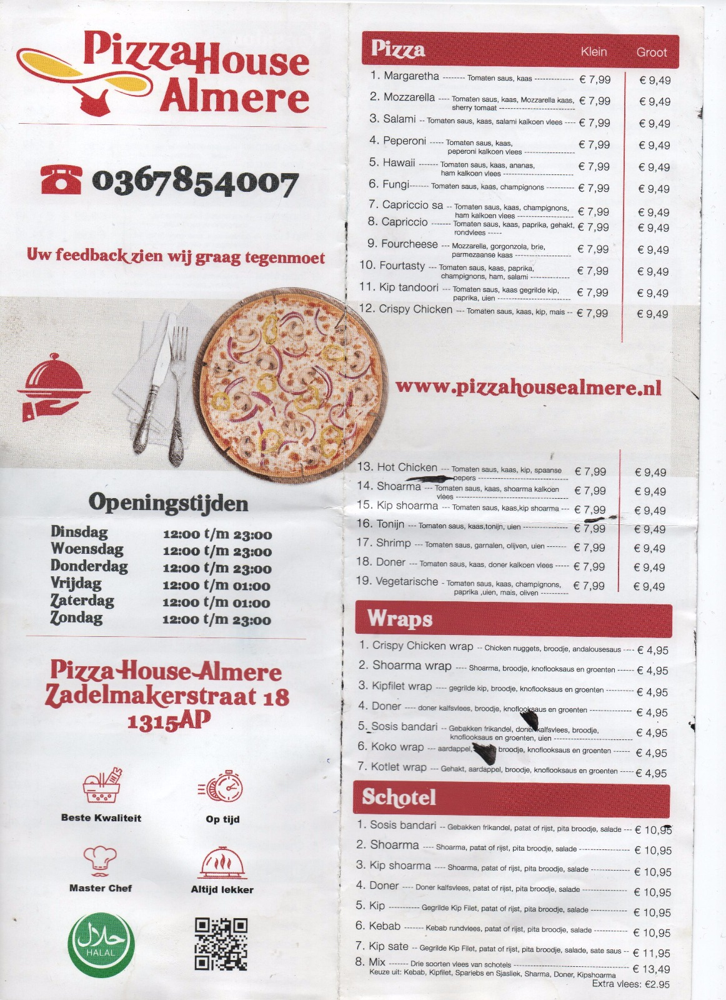

## About PizzaHouse

## PizzaHouse Developers

PizzaHouse is actively been developed by

- **[Vitalis](https://vivvaa.com/)**

If you discover a security vulnerability within PizzaHouse, please send an e-mail to Ogbonna Vitalis via [agavitalisogbonna@gmail.com](mailto:agavitalisogbonna@gmail.com). All security vulnerabilities will be promptly addressed.

## License

The PizzHouse framework is open-sourced software licensed under the [MIT license](https://opensource.org/licenses/MIT).
